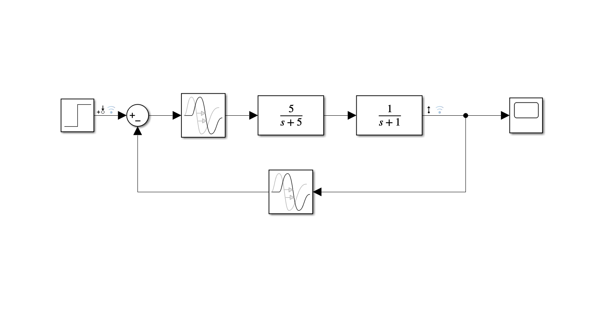
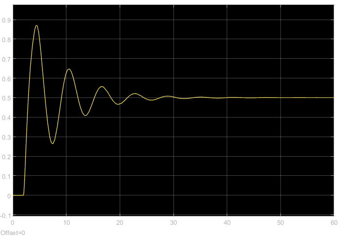
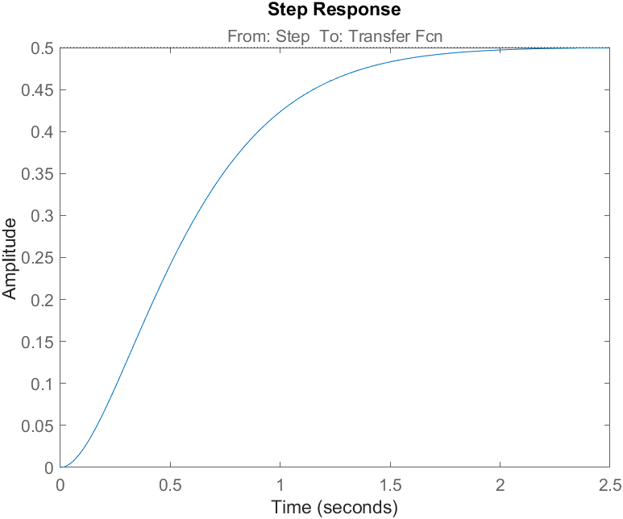
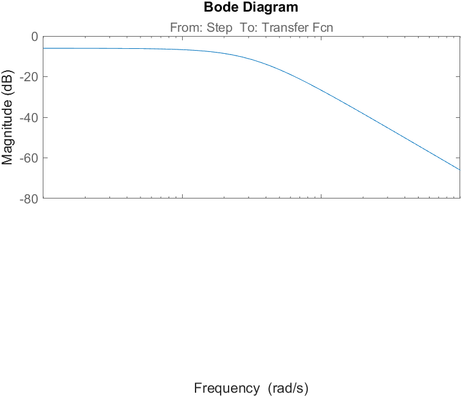
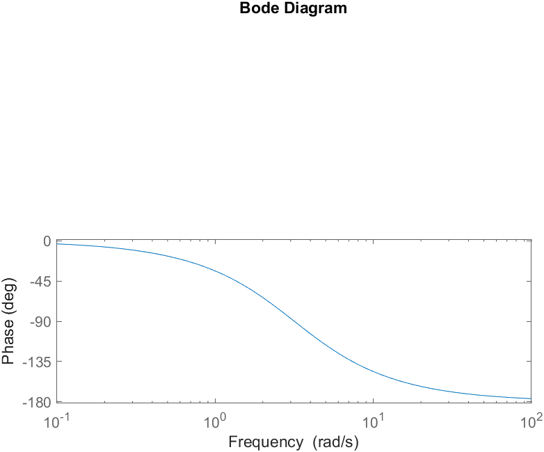

## System

Image 1. Schematic of the system



Image 2. Output scope of the system


[MATLAB code (Plotting step response and Bode diagram)](linear_system.m)


Image 3. Step response of the system



Image 3. Bode diagram of the system


## System linearization
System linearization in matlab:

```plaintext
General Information:

    Operating point: Model initial condition

    Size:  1 inputs, 1 outputs, 2 states

Linearization Result:

  A = 
       x1  x2
   x1  -1   5
   x2  -1  -5
 
  B = 
       u1
   x1   0
   x2   1
 
  C = 
       x1  x2
   y1   1   0
 
  D = 
       u1
   y1   0
 
Name: Linearization at model initial condition
Continuous-time state-space model.
Model Properties

State Names:
x1 - Transfer Fcn
x2 - Transfer Fcn1

Input Channel Names:
u1 - Step

Output Channel Names:
y1 - Transfer Fcn
```